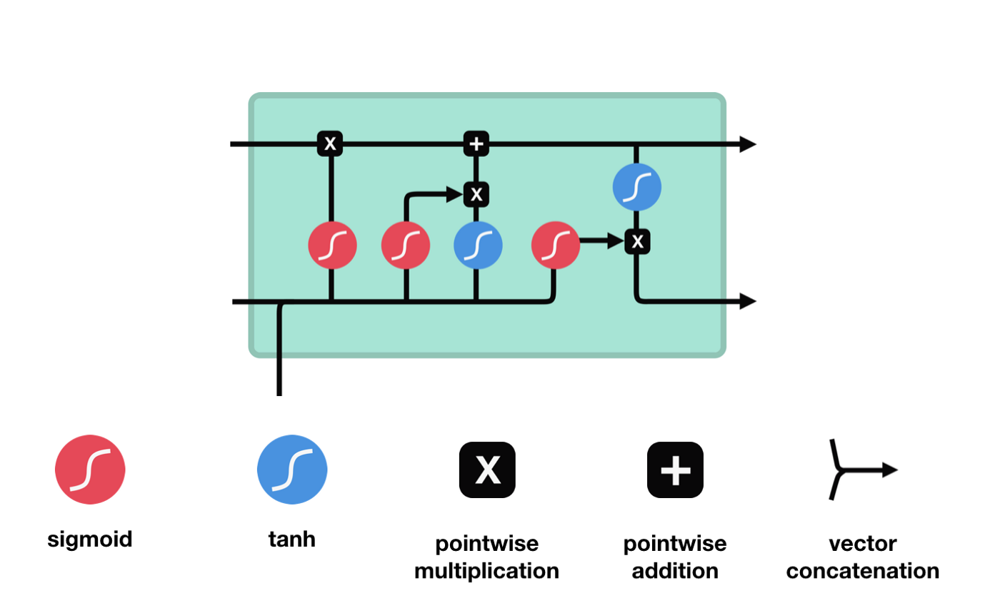
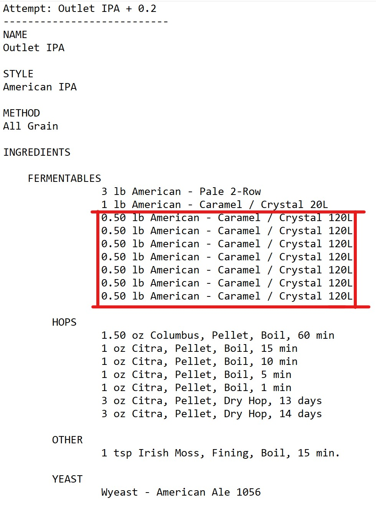
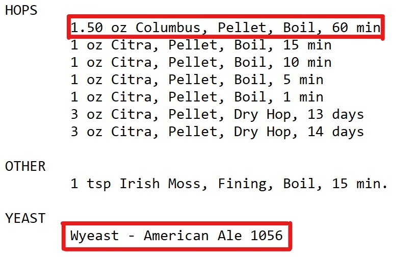
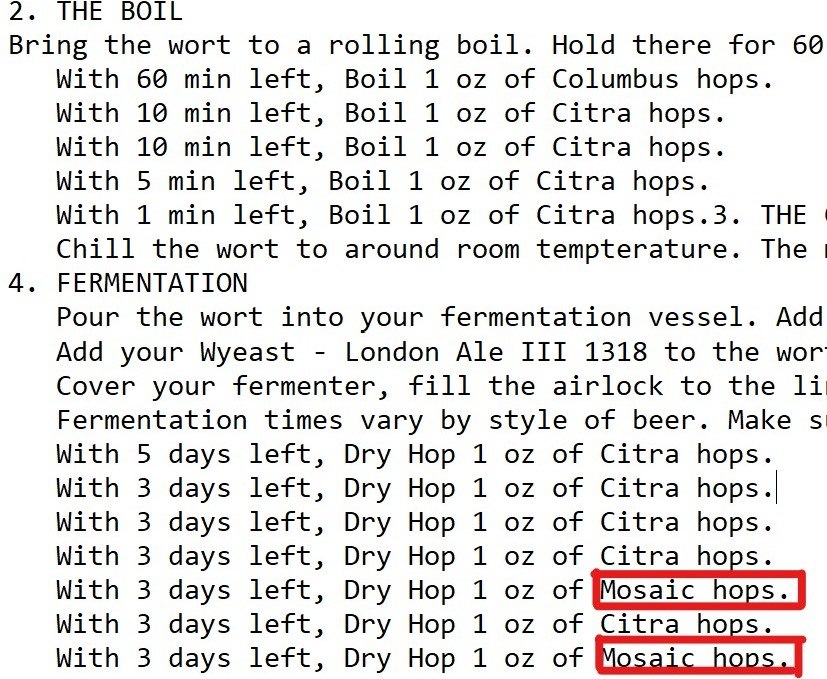
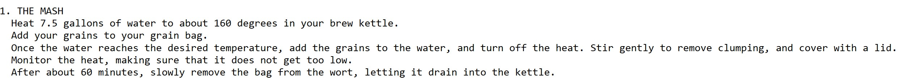
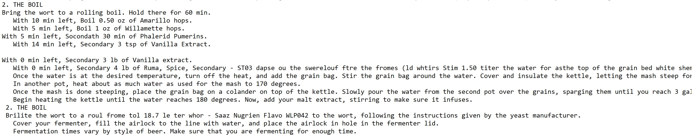

```{r setup, include=FALSE}
knitr::opts_chunk$set(
	echo = FALSE,
	message = FALSE,
	warning = FALSE
)
library(reticulate)
library(tidyverse)
```

# Model

## Recurrent Neural Networks


* Great for sequential data

## Long Short-Term Memory

{width=50%, height=50%}

* Better at processing longer sequences

## Our Model

* RNN with LSTM
* Trained its own embeddings
* Ran for 4 hours
  * 100 steps per epoch for 68 epochs
  
# Results

## A Lot of Caramel



## Ingredients Discrepancies

{width=35%, height=35%} {width=50%, height=50%}

## Extract Recipe



* These are mash instructions for brew in bag

## Varying Temperature



* Literal nonsense

# Improvements

## Training

* Only used 3,119 out of ~200,000 recipes
  * Took days to get this, with scalable computing and more time, could train more data
* Hyperparameter tuning
  * Did not have time to tune hyperparameters as model training took 4 hours

## Output Cleaning

* Remove duplicates in ingredients section.
* Repair disconnect between ingredients and intructions.

# Bibliography

## Sources

Britz, D. (2016, July 8). Recurrent Neural Networks Tutorial, Part 1 – Introduction to RNNs. WildML. http://www.wildml.com/2015/09/recurrent-neural-networks-tutorial-part-1-introduction-to-rnns/.

Pascanu, R., Gulcehre, C., Cho, K., Bengio, Y. (2014) How to Construct Deep Recurrent Neural Networks. Department of Information and Computer Sience, Aalto University School of Medicine.

Phi, M. (2018, Sep 24). Illustrated Guide to LSTM's and GRU's: A step by step explanation. Towards Data Science. https://towardsdatascience.com/illustrated-guide-to-lstms-and-gru-s-a-step-by-step-explanation-44e9eb85bf21

Sutskever, I. (2013) Training Recurrent Neural Networks. Graduate Department of Computer Science, University of Toronto.

